> A detailed architecture reference for understanding Apache Kafka internals through Graphviz/DOT diagrams.

---

## Table of Contents

1. [How to Read This Book](#how-to-read-this-book)
2. [Kafka Cluster: Big Picture](#1-kafka-cluster-big-picture)
3. [Broker Internal Architecture](#2-broker-internal-architecture)
4. [Kafka Request Processing Pipeline](#3-kafka-request-processing-pipeline)
5. [Producer Internals](#4-producer-internals)
6. [Producer Record Accumulation and Batching](#5-producer-record-accumulation-and-batching)
7. [Producer Network and Retry Flow](#6-producer-network-and-retry-flow)
8. [Consumer Internals](#7-consumer-internals)
9. [Consumer Fetch Pipeline](#8-consumer-fetch-pipeline)
10. [Consumer Groups and Coordination](#9-consumer-groups-and-coordination)
11. [Consumer Group Rebalancing](#10-consumer-group-rebalancing)
12. [Partition and Replica Architecture](#11-partition-and-replica-architecture)
13. [Replication Protocol](#12-replication-protocol)
14. [ISR, LEO, and High Watermark](#13-isr-leo-and-high-watermark)
15. [Kafka Log Internals](#14-kafka-log-internals)
16. [Log Segments and Indexes](#15-log-segments-and-indexes)
17. [Produce Path: Broker to Disk](#16-produce-path-broker-to-disk)
18. [Fetch Path: Disk/Page Cache to Consumer](#17-fetch-path-diskpage-cache-to-consumer)
19. [Page Cache and Zero-Copy](#18-page-cache-and-zero-copy)
20. [KRaft Architecture](#19-kraft-architecture)
21. [KRaft Metadata Quorum](#20-kraft-metadata-quorum)
22. [Controller and Broker Metadata Flow](#21-controller-and-broker-metadata-flow)
23. [Leader Election](#22-leader-election)
24. [Kafka Thread Model](#23-kafka-thread-model)
25. [Kafka Networking Internals](#24-kafka-networking-internals)
26. [Memory Architecture](#25-memory-architecture)
27. [Idempotent Producer](#26-idempotent-producer)
28. [Transactions and Exactly-Once Semantics](#27-transactions-and-exactly-once-semantics)
29. [Offset Management](#28-offset-management)
30. [End-to-End Message Lifecycle](#29-end-to-end-message-lifecycle)
31. [Broker Failure](#30-broker-failure)
32. [Leader Failure](#31-leader-failure)
33. [Consumer Failure](#32-consumer-failure)
34. [Controller Failure](#33-controller-failure)
35. [Network Partition](#34-network-partition)
36. [Kafka Internals Interview Map](#35-kafka-internals-interview-map)

---

# How to Read This Book

The diagrams are written in **Graphviz DOT**.

You can render them with:

```bash
dot -Tsvg diagram.dot -o diagram.svg
```

Or:

```bash
dot -Tpng diagram.dot -o diagram.png
```

For Markdown documentation, keep the DOT source blocks in the document and optionally render the resulting SVG/PNG beside them.

The diagrams intentionally show **logical Kafka internals**. Exact class names and internal implementation details can change between Kafka versions. The architectural concepts remain the important part.

---

# 1. Kafka Cluster: Big Picture

Kafka is a distributed log system composed of:

- Producers
- Brokers
- Topics
- Partitions
- Replicas
- Consumers
- Consumer groups
- Controllers
- KRaft metadata quorum

The fundamental storage unit is the **partition log**.

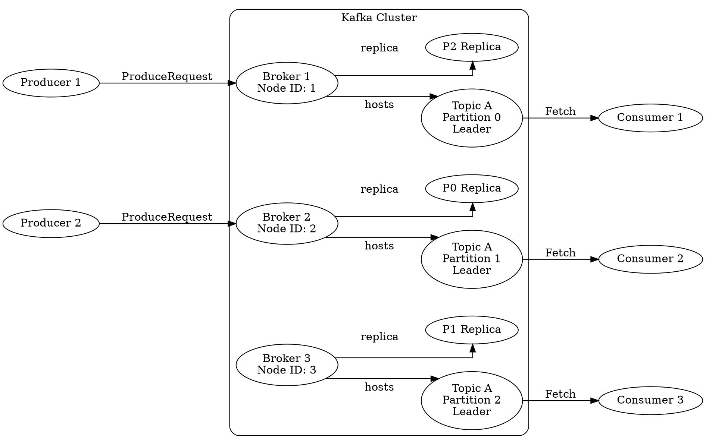

## Key idea

A Kafka topic is a logical name.

The topic is divided into partitions.

Each partition is an **ordered append-only log**.

Replication happens at the partition level.

A simplified hierarchy is:

```text
Cluster
  └── Topic
       └── Partition
            └── Replica
                 └── Log
                      └── LogSegment
                           └── RecordBatch
                                └── Record
```

---

# 2. Broker Internal Architecture

A Kafka broker is not simply a TCP server writing messages to disk.

Internally, a broker coordinates:

- Network connections
- Request parsing
- API handling
- Partition leadership
- Replication
- Log management
- Group coordination
- Transactions
- Metadata updates
- Storage
- Background maintenance

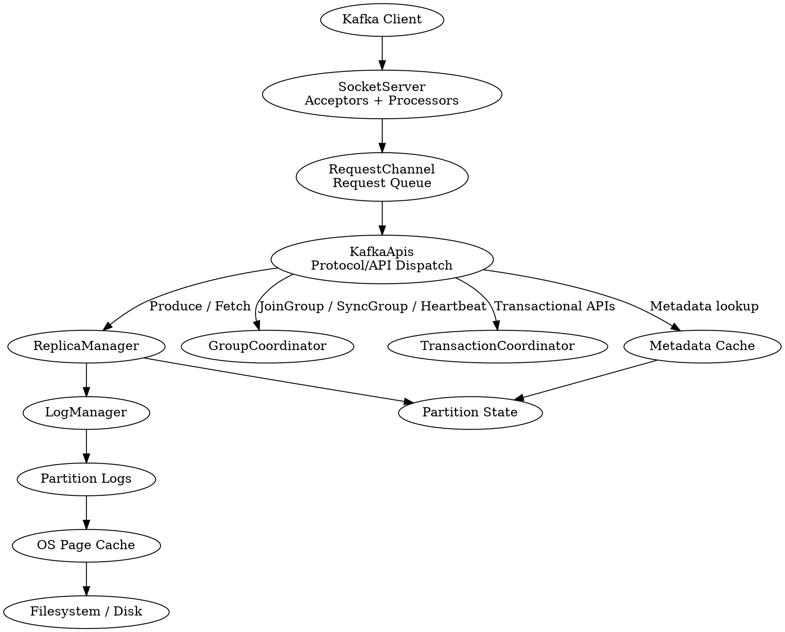

## Important internal responsibility boundaries

### SocketServer

Handles network-level request processing.

### RequestChannel

Decouples network processing from request handling.

### KafkaApis

Maps Kafka protocol requests to internal operations.

### ReplicaManager

Manages partition replicas and replication-related operations.

### LogManager

Owns the lifecycle of partition logs.

### GroupCoordinator

Manages consumer group state and offsets.

### TransactionCoordinator

Coordinates producer transactions.

### Metadata Cache

Allows brokers to quickly determine partition leadership and metadata state.

---

# 3. Kafka Request Processing Pipeline

The basic request lifecycle:

```dot
digraph KafkaRequestPipeline {
    rankdir=LR;

    Client [label="Kafka Client"];

    Acceptor [label="Acceptor"];
    Processor [label="Processor"];
    RequestQueue [label="RequestChannel"];

    Handler [label="Kafka Request Handler"];
    KafkaApis [label="KafkaApis"];

    HandlerType [label="Request Type"];

    ReplicaManager [label="ReplicaManager"];
    GroupCoordinator [label="GroupCoordinator"];
    TransactionCoordinator [label="TransactionCoordinator"];

    ResponseQueue [label="Response Queue"];
    ProcessorOut [label="Processor"];
    ClientResponse [label="Client Response"];

    Client -> Acceptor [label="TCP"];
    Acceptor -> Processor [label="socket"];
    Processor -> RequestQueue [label="Request"];
    RequestQueue -> Handler [label="dequeue"];

    Handler -> KafkaApis;
    KafkaApis -> HandlerType;

    HandlerType -> ReplicaManager [label="Produce / Fetch"];
    HandlerType -> GroupCoordinator [label="Group APIs"];
    HandlerType -> TransactionCoordinator [label="Transaction APIs"];

    ReplicaManager -> ResponseQueue;
    GroupCoordinator -> ResponseQueue;
    TransactionCoordinator -> ResponseQueue;

    ResponseQueue -> ProcessorOut;
    ProcessorOut -> ClientResponse;
}
```

The important architectural property is that **network I/O and request processing are separated**.

This prevents a slow disk operation or expensive request from directly blocking the network accept path.

---

# 4. Producer Internals

The Kafka producer is a sophisticated asynchronous pipeline.

```dot
digraph KafkaProducerInternals {
    rankdir=LR;

    Application [label="Application"];

    KafkaProducer [label="KafkaProducer"];
    Serializer [label="Key / Value Serializer"];
    Partitioner [label="Partitioner"];
    Metadata [label="Metadata Cache"];

    Accumulator [label="RecordAccumulator"];
    Batch0 [label="ProducerBatch\nPartition 0"];
    Batch1 [label="ProducerBatch\nPartition 1"];
    Batch2 [label="ProducerBatch\nPartition 2"];

    Sender [label="Sender Thread"];
    NetworkClient [label="NetworkClient"];
    Selector [label="Network Selector"];

    Broker [label="Kafka Broker"];

    Application -> KafkaProducer [label="send(record)"];

    KafkaProducer -> Serializer;
    KafkaProducer -> Metadata [label="partition metadata"];
    KafkaProducer -> Partitioner;

    Partitioner -> Accumulator;

    Accumulator -> Batch0;
    Accumulator -> Batch1;
    Accumulator -> Batch2;

    Batch0 -> Sender;
    Batch1 -> Sender;
    Batch2 -> Sender;

    Sender -> NetworkClient;
    NetworkClient -> Selector;
    Selector -> Broker [label="ProduceRequest"];

    Broker -> Selector [label="ProduceResponse"];
}
```

The critical insight:

> `send()` does not normally mean "write immediately to Kafka."

Instead:

1. The record is serialized.
2. A partition is selected.
3. The record enters the accumulator.
4. Records are grouped into batches.
5. The sender thread sends batches asynchronously.
6. The broker acknowledges according to the configured acknowledgment policy.

---

# 5. Producer Record Accumulation and Batching

The accumulator groups records by topic-partition.

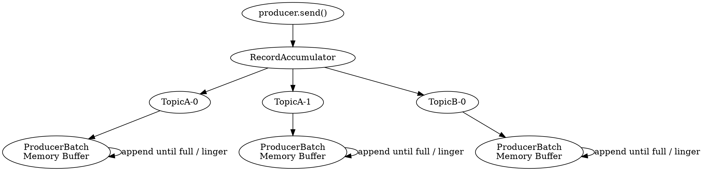

Two major batching controls:

- `batch.size`
- `linger.ms`

A batch may become sendable because:

- It reaches its configured size.
- Its linger timer expires.
- The producer is flushing.
- The producer is closing.
- Other send conditions trigger transmission.

Batching improves throughput by reducing:

- Network request count
- Per-request protocol overhead
- System calls
- Broker request processing overhead

Compression is normally applied at the **record batch** level.

---

# 6. Producer Network and Retry Flow

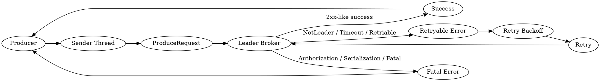

Retries are not equivalent to "at least once" in every configuration.

Producer behavior depends on:

- `enable.idempotence`
- `acks`
- retry configuration
- delivery timeout
- request timeout
- broker state

With idempotence enabled, sequence numbers allow the broker to detect duplicate producer requests.

---

# 7. Consumer Internals

The consumer architecture is pull-based.

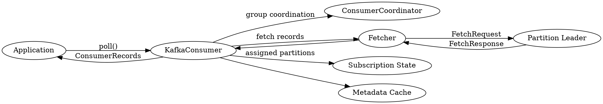

The consumer does not receive pushed messages from Kafka.

Instead:

```text
Consumer
   |
   | FetchRequest
   v
Broker
   |
   | FetchResponse
   v
Consumer
   |
   | poll()
   v
Application
```

This pull model allows consumers to control their consumption rate.

---

# 8. Consumer Fetch Pipeline

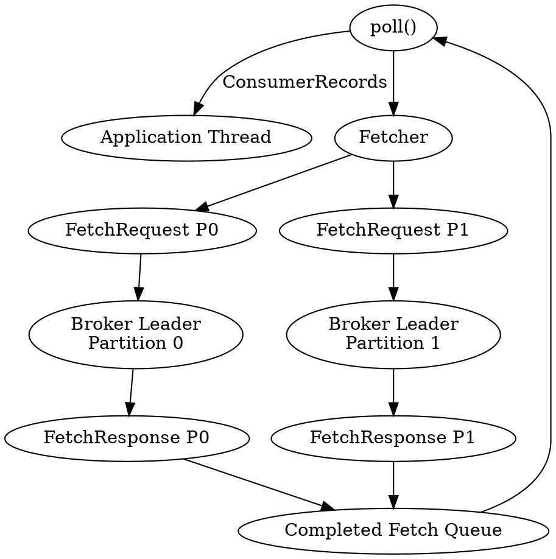

Important consumer concepts:

- `fetch.min.bytes`
- `fetch.max.wait.ms`
- `max.partition.fetch.bytes`
- `fetch.max.bytes`
- `max.poll.records`
- `max.poll.interval.ms`
- `session.timeout.ms`
- `heartbeat.interval.ms`

These parameters affect different parts of the lifecycle.

A common mistake is to treat `max.poll.records` as a network fetch size. It is not.

---

# 9. Consumer Groups and Coordination

A consumer group distributes partitions among group members.

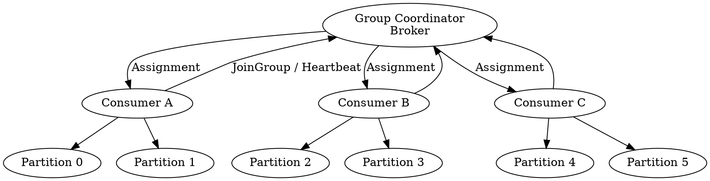

A consumer group has a key invariant:

> At a given time, one partition is assigned to at most one active consumer in the same group.

Multiple consumer groups can independently consume the same partition.

```text
Topic-A
  Partition-0
      |
      +---- Group-Orders
      |
      +---- Group-Analytics
      |
      +---- Group-Audit
```

---

# 10. Consumer Group Rebalancing

A rebalance changes the partition ownership map.

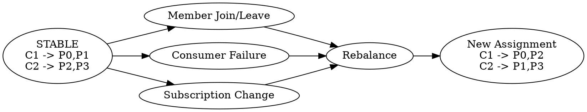

Typical causes:

- Consumer joins
- Consumer leaves
- Consumer crashes
- Session timeout
- Subscription changes
- Group metadata changes

The rebalance protocol and assignment strategy determine how disruptive the transition is.

Modern Kafka deployments may use cooperative rebalancing to reduce unnecessary partition revocation.

---

# 11. Partition and Replica Architecture

A partition has:

- One leader
- Zero or more followers
- An ordered log
- A replica set

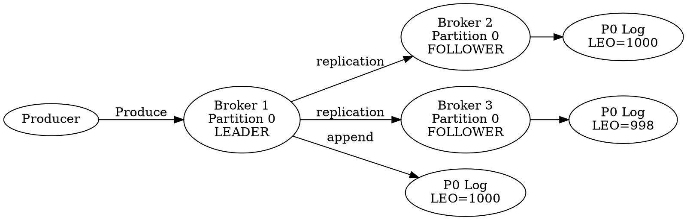

Only the partition leader normally handles client produce and fetch requests for that partition.

Followers replicate the leader's log.

---

# 12. Replication Protocol

Conceptually:

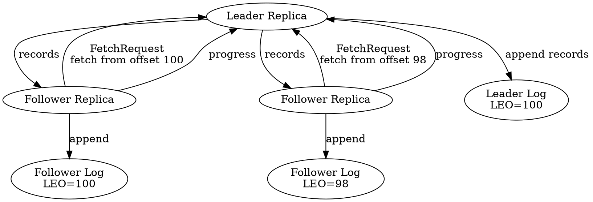

Kafka replication is pull-oriented from the follower perspective.

The follower fetches records from the leader.

This allows the follower to control how quickly it catches up.

---

# 13. ISR, LEO, and High Watermark

These concepts are essential for Kafka internals.

### LEO

**Log End Offset**.

The next offset that will be written to the log.

### High Watermark

The offset boundary up to which records are considered committed/visible for normal consumer reads.

### ISR

**In-Sync Replicas**.

Replicas sufficiently caught up with the leader according to Kafka's replication rules.

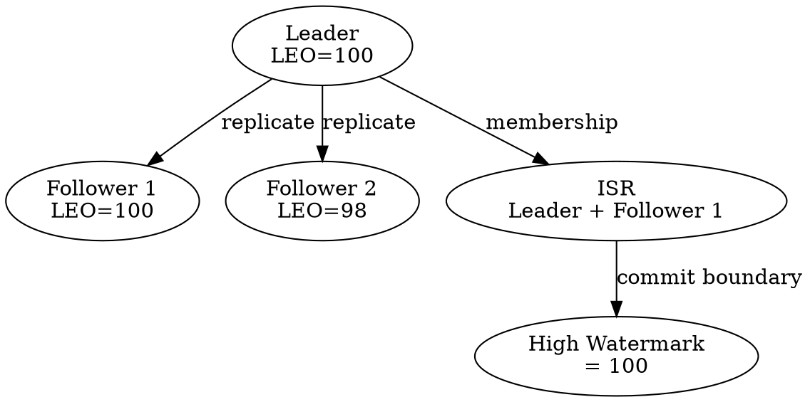

A simplified conceptual relationship:

```text
HighWatermark ≈ minimum replicated progress among required in-sync replicas
```

The exact implementation and timing details are more nuanced, but this mental model is useful.

---

# 14. Kafka Log Internals

Each partition is represented as a log.

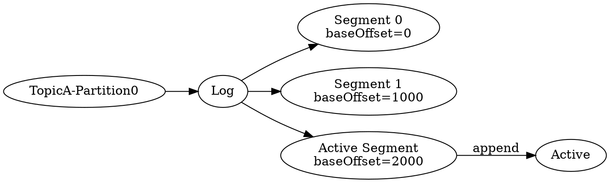

Kafka does not maintain one infinite file per partition.

The log is divided into segments.

The active segment receives new records.

Older segments can be:

- Rolled
- Compacted
- Deleted according to retention

---

# 15. Log Segments and Indexes

A segment commonly has related files:

```text
00000000000000000000.log
00000000000000000000.index
00000000000000000000.timeindex
```

Conceptually:

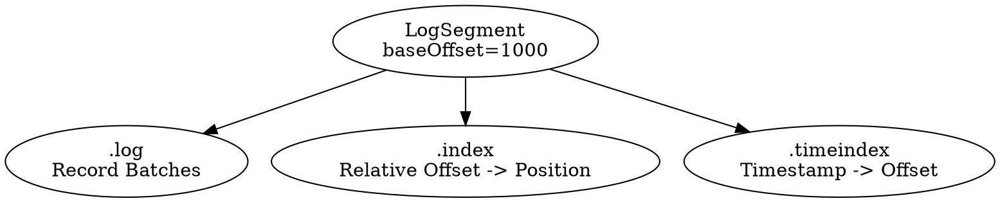

The offset index is sparse rather than a full mapping for every record.

A lookup is conceptually:

```text
Requested offset
      |
      v
Find segment
      |
      v
Consult sparse offset index
      |
      v
Find approximate file position
      |
      v
Scan records forward
      |
      v
Return matching data
```

```dot
digraph OffsetLookup {
    rankdir=LR;

    Offset [label="Requested Offset"];
    SegmentLookup [label="Segment Lookup"];
    Index [label="Sparse Offset Index"];
    FilePosition [label="Approximate File Position"];
    Scan [label="Sequential Scan"];
    Record [label="Target Record"];

    Offset -> SegmentLookup;
    SegmentLookup -> Index;
    Index -> FilePosition;
    FilePosition -> Scan;
    Scan -> Record;
}
```

---

# 16. Produce Path: Broker to Disk

A simplified produce path:

```dot
digraph ProducePath {
    rankdir=LR;

    Client [label="Producer"];
    Network [label="Network Layer"];
    API [label="KafkaApis"];
    ReplicaManager [label="ReplicaManager"];
    Partition [label="Leader Partition"];
    Log [label="Partition Log"];
    PageCache [label="OS Page Cache"];
    Disk [label="Disk"];

    Client -> Network [label="ProduceRequest"];
    Network -> API;
    API -> ReplicaManager;
    ReplicaManager -> Partition;
    Partition -> Log [label="append"];
    Log -> PageCache [label="write"];
    PageCache -> Disk [label="eventual flush"];

    Partition -> ReplicaManager [label="replication state"];
    ReplicaManager -> Network [label="ProduceResponse"];
    Network -> Client;
}
```

Important:

> An acknowledgment does not necessarily mean the bytes have been synchronously flushed to physical disk.

Kafka relies heavily on the operating system page cache.

Durability and availability are primarily achieved through replication.

---

# 17. Fetch Path: Disk/Page Cache to Consumer

```dot
digraph FetchPath {
    rankdir=LR;

    Consumer [label="Consumer"];
    Network [label="Network"];
    KafkaApis [label="KafkaApis"];
    ReplicaManager [label="ReplicaManager"];
    Partition [label="Partition"];
    Log [label="Log"];
    PageCache [label="OS Page Cache"];
    Disk [label="Disk"];

    Consumer -> Network [label="FetchRequest"];
    Network -> KafkaApis;
    KafkaApis -> ReplicaManager;
    ReplicaManager -> Partition;
    Partition -> Log;

    Log -> PageCache [label="read"];
    PageCache -> Disk [label="cache miss"];

    Log -> ReplicaManager [label="records"];
    ReplicaManager -> KafkaApis;
    KafkaApis -> Network;
    Network -> Consumer [label="FetchResponse"];
}
```

Kafka's performance benefits strongly from sequential I/O and page-cache locality.

---

# 18. Page Cache and Zero-Copy

Kafka's high throughput is closely related to the OS page cache.

Conceptually:

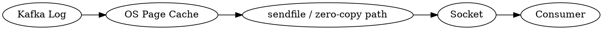

The conceptual goal is to avoid unnecessary copies:

```text
Disk
  ↓
OS Page Cache
  ↓
Kernel networking
  ↓
Socket
  ↓
Consumer
```

The exact code path depends on the request type, protocol, encryption, compression, and operating system capabilities.

TLS can change the optimal path because encrypted transport may require additional processing.

---

# 19. KRaft Architecture

Modern Kafka uses KRaft for metadata management.

KRaft replaces the historical ZooKeeper dependency.

The architecture separates:

- Broker responsibilities
- Controller responsibilities

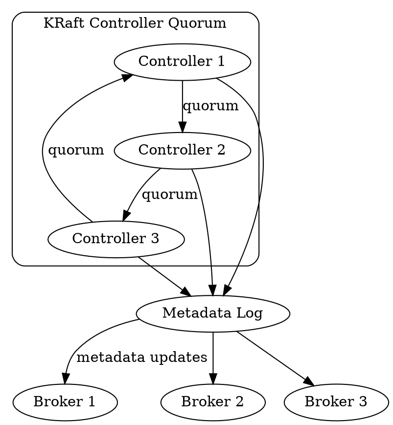

The KRaft metadata quorum maintains the cluster's authoritative metadata state.

---

# 20. KRaft Metadata Quorum

The controller quorum uses a replicated metadata log.

```dot
digraph KRaftMetadataQuorum {
    rankdir=LR;

    Client [label="Admin / Broker Event"];

    Leader [label="Active Controller\nLeader"];
    Follower1 [label="Controller Follower"];
    Follower2 [label="Controller Follower"];

    MetadataLog [label="Replicated Metadata Log"];

    Client -> Leader [label="metadata operation"];

    Leader -> MetadataLog [label="append metadata record"];

    Leader -> Follower1 [label="replicate"];
    Leader -> Follower2 [label="replicate"];

    Follower1 -> MetadataLog;
    Follower2 -> MetadataLog;
}
```

Metadata records can represent changes such as:

- Topic creation
- Partition changes
- Replica assignments
- Config changes
- Feature levels
- Broker registration
- Partition leadership state

The metadata log is not the same thing as application topic data.

---

# 21. Controller and Broker Metadata Flow

```dot
digraph ControllerBrokerMetadata {
    rankdir=LR;

    Controller [label="KRaft Controller"];
    MetadataLog [label="Metadata Log"];

    Broker1 [label="Broker 1"];
    Broker2 [label="Broker 2"];
    Broker3 [label="Broker 3"];

    Controller -> MetadataLog [label="commit metadata"];
    MetadataLog -> Broker1 [label="metadata event"];
    MetadataLog -> Broker2;
    MetadataLog -> Broker3;

    Broker1 -> Broker1 [label="update local metadata cache"];
    Broker2 -> Broker2 [label="update local metadata cache"];
    Broker3 -> Broker3 [label="update local metadata cache"];
}
```

The controller is the authority for cluster metadata.

Brokers maintain local views/caches needed to process client requests efficiently.

---

# 22. Leader Election

A partition leader can change when a broker fails.

```dot
digraph LeaderElection {
    rankdir=LR;

    OldLeader [label="Broker 1\nOld Leader"];
    Failure [label="Broker 1 Failure"];

    Controller [label="KRaft Controller"];

    Candidate1 [label="Broker 2\nReplica"];
    Candidate2 [label="Broker 3\nReplica"];

    NewLeader [label="New Leader\nBroker 2"];

    OldLeader -> Failure;
    Failure -> Controller;

    Controller -> Candidate1 [label="elect"];
    Controller -> Candidate2 [label="candidate"];

    Candidate1 -> NewLeader;
}
```

The exact election outcome depends on:

- Replica state
- ISR membership
- Election policy
- Unclean leader election configuration

The key principle is that leadership is a metadata decision coordinated by the controller.

---

# 23. Kafka Thread Model

A broker has multiple execution domains.

```dot
digraph KafkaThreadModel {
    rankdir=TB;

    Clients [label="Clients"];

    Acceptor [label="Acceptor Threads"];
    Processors [label="Network Processor Threads"];
    RequestQueue [label="Request Queue"];

    RequestHandlers [label="Request Handler Threads"];

    ReplicaManager [label="ReplicaManager"];
    GroupCoordinator [label="GroupCoordinator"];
    LogManager [label="LogManager"];

    Background [label="Background Threads"];

    Clients -> Acceptor;
    Acceptor -> Processors;
    Processors -> RequestQueue;

    RequestQueue -> RequestHandlers;

    RequestHandlers -> ReplicaManager;
    RequestHandlers -> GroupCoordinator;
    RequestHandlers -> LogManager;

    Background -> LogManager [label="cleanup / retention"];
    Background -> ReplicaManager [label="replication tasks"];
}
```

Kafka concurrency is intentionally divided into specialized roles.

This prevents a single workload from monopolizing all broker execution resources.

---

# 24. Kafka Networking Internals

Conceptual network architecture:

```dot
digraph KafkaNetwork {
    rankdir=LR;

    Client [label="Kafka Client"];

    Acceptor [label="Acceptor\nAccept TCP"];
    Processor [label="Processor\nRead/Write Socket"];
    RequestChannel [label="RequestChannel"];

    Handler [label="Request Handler"];
    ResponseChannel [label="Response"];

    Client -> Acceptor [label="TCP connection"];
    Acceptor -> Processor;
    Processor -> RequestChannel [label="request"];
    RequestChannel -> Handler;

    Handler -> ResponseChannel;
    ResponseChannel -> Processor [label="response"];
    Processor -> Client;
}
```

A typical broker request lifecycle is:

```text
Socket
  ↓
Processor
  ↓
RequestChannel
  ↓
Request Handler
  ↓
KafkaApis
  ↓
Internal subsystem
  ↓
Response
  ↓
Processor
  ↓
Socket
```

---

# 25. Memory Architecture

Kafka uses several important memory areas.

```dot
digraph KafkaMemory {
    rankdir=TB;

    JVM [label="JVM Process"];

    Heap [label="JVM Heap"];
    Direct [label="Direct / Native Buffers"];
    PageCache [label="OS Page Cache"];

    Producer [label="Producer Memory\nClient Side"];
    BrokerBuffers [label="Network / Request Buffers"];

    Logs [label="Kafka Log Files"];

    JVM -> Heap;
    JVM -> Direct;

    Heap -> BrokerBuffers;

    Logs -> PageCache;
    PageCache -> Logs;

    Producer -> JVM;
}
```

A common misconception is:

> Kafka stores all messages in the JVM heap.

It does not.

Kafka relies heavily on the operating system page cache for log data.

This is one reason JVM heap sizing should not simply consume all available machine RAM.

---

# 26. Idempotent Producer

Idempotence addresses duplicate writes caused by retries.

Conceptually:

```dot
digraph IdempotentProducer {
    rankdir=LR;

    Producer [label="Producer"];
    PID [label="Producer ID"];
    Sequence [label="Sequence Number"];

    Request1 [label="Produce\nPID=10 Seq=42"];
    Retry [label="Retry\nPID=10 Seq=42"];

    Broker [label="Partition Leader"];
    Dedup [label="Sequence Validation"];

    Producer -> PID;
    Producer -> Sequence;

    PID -> Request1;
    Sequence -> Request1;

    Request1 -> Broker;
    Broker -> Dedup;

    Producer -> Retry;
    Retry -> Broker;

    Broker -> Dedup [label="same PID + sequence"];
    Dedup -> Broker [label="detect duplicate"];
}
```

The broker can use producer identity and sequence information to recognize duplicate requests.

This is fundamentally different from application-level deduplication.

---

# 27. Transactions and Exactly-Once Semantics

Transactions coordinate writes across Kafka partitions and consumer offsets.

A simplified flow:

```dot
digraph KafkaTransaction {
    rankdir=LR;

    Application [label="Application"];

    Producer [label="Transactional Producer"];
    TxCoordinator [label="Transaction Coordinator"];
    PartitionA [label="Partition A"];
    PartitionB [label="Partition B"];
    OffsetTopic [label="Consumer Offsets"];
    Consumer [label="Downstream Consumer"];

    Application -> Producer [label="beginTransaction"];

    Producer -> TxCoordinator [label="transaction state"];

    Producer -> PartitionA [label="transactional records"];
    Producer -> PartitionB [label="transactional records"];

    Application -> Producer [label="sendOffsetsToTransaction"];

    Producer -> OffsetTopic [label="transactional offset commit"];

    Application -> Producer [label="commitTransaction"];

    TxCoordinator -> PartitionA [label="commit markers"];
    TxCoordinator -> PartitionB [label="commit markers"];
    TxCoordinator -> OffsetTopic [label="commit"];

    Consumer -> PartitionA [label="read_committed"];
    Consumer -> PartitionB [label="read_committed"];
}
```

Exactly-once semantics require understanding several components together:

- Idempotent producer
- Producer IDs
- Epochs
- Sequence numbers
- Transaction coordinator
- Transaction markers
- Read isolation
- Offset commits as part of the transaction

"Exactly once" should always be interpreted within a defined processing boundary.

---

# 28. Offset Management

Consumer offsets are stored in Kafka's internal offsets topic.

```dot
digraph OffsetManagement {
    rankdir=LR;

    Consumer [label="Consumer"];
    GroupCoordinator [label="Group Coordinator"];
    OffsetTopic [label="__consumer_offsets"];

    Consumer -> GroupCoordinator [label="OffsetCommit"];
    GroupCoordinator -> OffsetTopic [label="persist offset"];

    OffsetTopic -> GroupCoordinator [label="load offset"];
    GroupCoordinator -> Consumer [label="OffsetFetch"];
}
```

The conceptual lifecycle:

```text
Fetch records
    ↓
Application processes records
    ↓
Application decides commit point
    ↓
OffsetCommit
    ↓
Group Coordinator
    ↓
__consumer_offsets
```

The commit point is a business correctness decision.

For example:

```text
Poll
  ↓
Process
  ↓
Commit
```

is different from:

```text
Poll
  ↓
Commit
  ↓
Process
```

The first tends toward at-least-once processing when failures occur.

The second can produce at-most-once behavior.

---

# 29. End-to-End Message Lifecycle

This is the most important architecture diagram in the book.

```dot
digraph EndToEndKafka {
    rankdir=LR;

    App [label="Producer Application"];
    Producer [label="KafkaProducer"];
    Accumulator [label="RecordAccumulator"];
    Sender [label="Sender"];
    Broker [label="Leader Broker"];
    ReplicaManager [label="ReplicaManager"];
    Partition [label="Leader Partition"];
    Log [label="Partition Log"];
    PageCache [label="OS Page Cache"];
    Followers [label="Follower Replicas"];
    Consumer [label="Consumer"];
    Fetcher [label="Fetcher"];
    ConsumerApp [label="Consumer Application"];

    App -> Producer [label="send"];
    Producer -> Accumulator [label="batch"];
    Accumulator -> Sender;
    Sender -> Broker [label="ProduceRequest"];

    Broker -> ReplicaManager;
    ReplicaManager -> Partition;
    Partition -> Log [label="append"];

    Log -> PageCache;

    Partition -> Followers [label="replicate"];

    Broker -> Sender [label="ProduceResponse"];
    Sender -> Producer;

    ConsumerApp -> Consumer [label="poll"];
    Consumer -> Fetcher;
    Fetcher -> Broker [label="FetchRequest"];

    Broker -> Fetcher [label="FetchResponse"];
    Fetcher -> Consumer;
    Consumer -> ConsumerApp [label="records"];
}
```

A message therefore passes through several layers:

```text
Application
  ↓
Producer API
  ↓
Serialization
  ↓
Partitioning
  ↓
RecordAccumulator
  ↓
ProducerBatch
  ↓
Sender
  ↓
Network
  ↓
Leader Broker
  ↓
ReplicaManager
  ↓
Partition
  ↓
Log
  ↓
Page Cache
  ↓
Replication
  ↓
Consumer Fetch
  ↓
Consumer Poll
  ↓
Application
```

---

# 30. Broker Failure

Suppose Broker 1 fails.

```dot
digraph BrokerFailure {
    rankdir=LR;

    B1 [label="Broker 1\nLeader\nFAILED"];
    Controller [label="KRaft Controller"];
    B2 [label="Broker 2\nFollower"];
    B3 [label="Broker 3\nFollower"];

    NewLeader [label="Broker 2\nNEW LEADER"];

    B1 -> Controller [label="failure detected"];
    Controller -> B2 [label="elect leader"];
    Controller -> B3 [label="update metadata"];

    B2 -> NewLeader;
}
```

Clients may initially receive:

- Connection failures
- NotLeader errors
- Metadata refresh requirements
- Timeout responses

The client refreshes metadata and reconnects to the new leader.

---

# 31. Leader Failure

```dot
digraph PartitionLeaderFailure {
    rankdir=TB;

    Partition [label="Topic-0"];

    Leader [label="Broker 1\nLeader"];
    Follower1 [label="Broker 2\nISR"];
    Follower2 [label="Broker 3\nISR"];

    Controller [label="KRaft Controller"];

    Leader -> Partition;
    Follower1 -> Partition;
    Follower2 -> Partition;

    Leader -> Controller [label="failure"];
    Controller -> Follower1 [label="new leader"];
    Follower1 -> Partition [label="Leader"];
}
```

The key distinction:

- Broker failure is a node-level event.
- Leader failure is a partition-level leadership event.

One broker may host hundreds or thousands of partitions.

A broker failure can therefore trigger many partition leadership transitions.

---

# 32. Consumer Failure

```dot
digraph ConsumerFailure {
    rankdir=LR;

    C1 [label="Consumer A\nFAILED"];
    Coordinator [label="Group Coordinator"];

    P0 [label="P0"];
    P1 [label="P1"];

    C2 [label="Consumer B"];
    C3 [label="Consumer C"];

    C1 -> Coordinator [label="heartbeat stops"];

    Coordinator -> C1 [label="session timeout"];

    Coordinator -> C2 [label="rebalance"];
    Coordinator -> C3 [label="rebalance"];

    C2 -> P0;
    C3 -> P1;
}
```

The actual behavior depends on:

- Session timeout
- Heartbeats
- Consumer group protocol
- Rebalance strategy
- Static membership
- Cooperative assignment

---

# 33. Controller Failure

In a KRaft controller quorum:

```dot
digraph ControllerFailure {
    rankdir=LR;

    C1 [label="Controller 1\nLEADER\nFAILED"];
    C2 [label="Controller 2\nFOLLOWER"];
    C3 [label="Controller 3\nFOLLOWER"];

    Election [label="Quorum Election"];

    NewLeader [label="Controller 2\nNEW LEADER"];

    C1 -> Election [label="failure"];
    C2 -> Election;
    C3 -> Election;

    Election -> NewLeader;
}
```

The important concept:

> Controller failure should not imply loss of application data.

The metadata quorum is replicated independently from the application partition data.

---

# 34. Network Partition

Network failures can be more subtle than process failures.

```dot
digraph NetworkPartition {
    rankdir=LR;

    subgraph cluster_left {
        label="Network Segment A";

        B1 [label="Broker 1"];
        B2 [label="Broker 2"];
    }

    subgraph cluster_right {
        label="Network Segment B";

        B3 [label="Broker 3"];
        B4 [label="Broker 4"];
    }

    Partition [label="NETWORK PARTITION"];

    B1 -> Partition;
    B2 -> Partition;
    Partition -> B3;
    Partition -> B4;
}
```

Possible consequences:

- Broker disconnects
- Replica lag
- ISR changes
- Leader election
- Client retries
- Metadata refreshes
- Consumer group rebalances
- Controller quorum concerns

Kafka's behavior depends heavily on which nodes can still communicate.

---

# 35. Kafka Internals Interview Map

For senior Kafka interviews, be able to explain these flows without memorization.

## Producer

```text
send()
  ↓
serialize
  ↓
partition selection
  ↓
RecordAccumulator
  ↓
ProducerBatch
  ↓
Sender
  ↓
ProduceRequest
  ↓
Leader
```

## Consumer

```text
poll()
  ↓
Fetcher
  ↓
FetchRequest
  ↓
Partition Leader
  ↓
FetchResponse
  ↓
ConsumerRecords
```

## Replication

```text
Leader
  ↓
Follower FetchRequest
  ↓
Leader returns records
  ↓
Follower appends
  ↓
Follower progress advances
  ↓
ISR / HW state evolves
```

## Consumer Group

```text
Consumer
  ↓
Group Coordinator
  ↓
JoinGroup
  ↓
Assignment
  ↓
SyncGroup
  ↓
Fetch
  ↓
Heartbeat
```

## KRaft

```text
Controller Quorum
  ↓
Metadata Log
  ↓
Committed Metadata
  ↓
Broker Metadata State
```

## Failure

```text
Failure
  ↓
Detection
  ↓
Controller / Coordinator action
  ↓
Leader or membership transition
  ↓
Metadata propagation
  ↓
Client recovery
```

---

# Final Mental Model

Kafka can be understood as five cooperating systems:

```dot
digraph KafkaFiveSystems {
    rankdir=TB;

    ClientPlane [label="1. CLIENT PLANE\nProducer + Consumer"];
    BrokerPlane [label="2. BROKER DATA PLANE\nProduce + Fetch"];
    StoragePlane [label="3. STORAGE PLANE\nLogs + Segments + Page Cache"];
    ReplicationPlane [label="4. REPLICATION PLANE\nLeader + Followers + ISR"];
    MetadataPlane [label="5. CONTROL PLANE\nKRaft Controller + Metadata Quorum"];

    ClientPlane -> BrokerPlane;
    BrokerPlane -> StoragePlane;
    BrokerPlane -> ReplicationPlane;
    MetadataPlane -> BrokerPlane;
    MetadataPlane -> ReplicationPlane;
}
```

The most useful architecture mental model is:

```text
                     KAFKA CLUSTER
                           |
          +----------------+----------------+
          |                                 |
     CONTROL PLANE                    DATA PLANE
          |                                 |
     KRaft Quorum                    Kafka Brokers
          |                                 |
     Metadata Log               +-----------+-----------+
          |                     |                       |
     Broker Metadata       Produce Path           Fetch Path
                                |                       |
                           Partition Leader       Partition Leader
                                |                       |
                            ReplicaManager       ReplicaManager
                                |                       |
                              LogManager             LogManager
                                |                       |
                         Log / Segments         Log / Segments
                                |                       |
                          Page Cache             Page Cache
                                |                       |
                           Replication            Consumer
```

If you understand these five planes and how they interact, you have the foundation needed to reason about Kafka performance, reliability, replication, failures, and production troubleshooting.